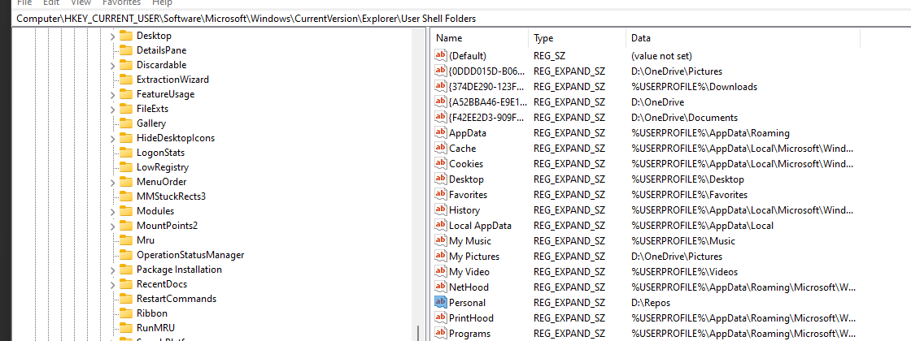

## How to add a PowerShell profile script

1. Update this registry key to a path as desired using regedit: `HKEY_CURRENT_USER\Software\Microsoft\Windows\CurrentVersion\Explorer\User Shell Folders`

 |
------------ | 
_Updating registry key_ | 

2. Run this in PowerShell to allow local scripts to be run `Set-ExecutionPolicy -ExecutionPolicy RemoteSigned -Scope CurrentUser`
3. Add `Microsoft.PowerShell_profile.ps1` to the location specified in the first step (adding `\WindowsPowerShell` to the path)
   * In this example, the path is `D:\Repos\WindowsPowerShell\Microsoft.PowerShell_profile.ps1`